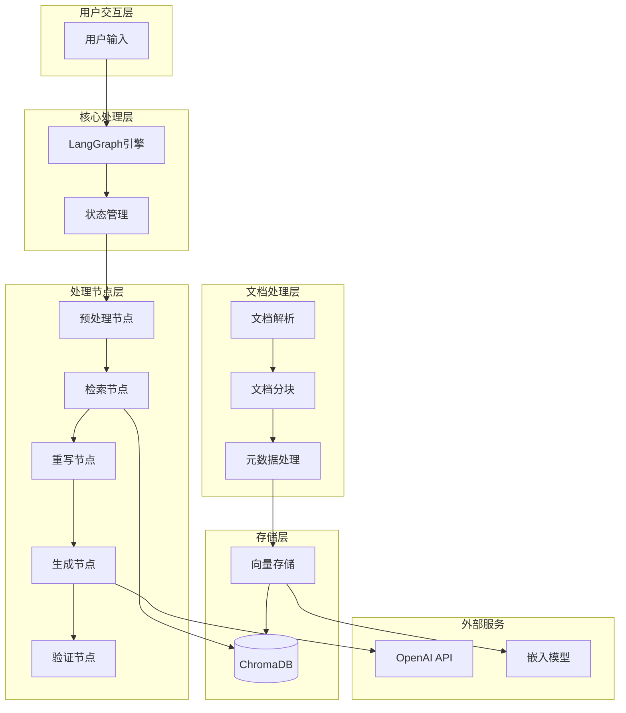
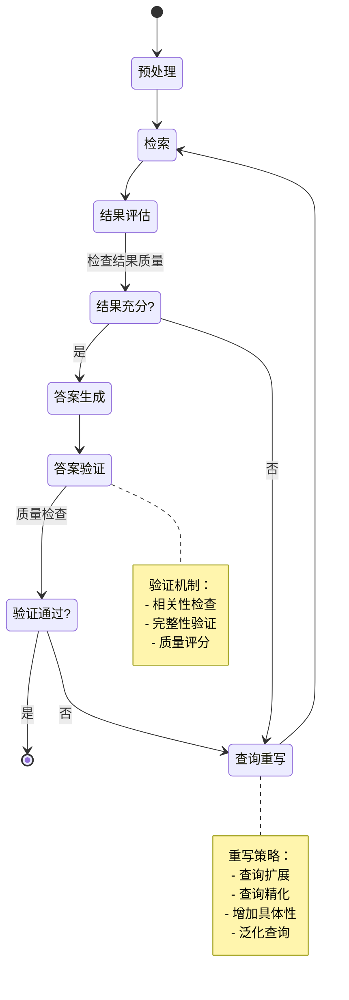

# 智能对话系统

基于 LangGraph 的智能对话系统，集成了文档处理、向量检索、自我纠错等功能，提供高质量的问答体验。

## 系统特性

### 核心功能
- **智能查询处理**: 支持查询预处理和意图检测
- **文档智能检索**: 基于向量相似度的精准检索
- **自我纠错机制**: 自动检测和纠正错误答案
- **文档分块处理**: 支持语义分块和结构化分块
- **元数据管理**: 文档元数据提取和增强
- **查询重写优化**: 动态优化查询以提升检索效果

### 技术亮点
- **LangGraph状态管理**: 可视化的对话流程控制
- **混合检索策略**: 结合语义检索和MMR算法
- **智能分块算法**: 保持语义完整性的文档分割
- **多层相关性评分**: 确保检索结果的高质量
- **ChromaDB向量存储**: 高效的向量数据库支持
- **模块化架构**: 易于维护和扩展的代码结构

## 系统架构

### 整体架构图



### LangGraph状态流转图



## 核心功能实现

### 查询预处理

查询预处理负责清理和标准化用户输入，提取关键信息：

```python
def preprocess_query_node(state: ConversationState) -> ConversationState:
    """预处理查询节点"""
    query = state.question
    
    # 清理和标准化查询
    cleaned_query = clean_and_normalize_query(query)
    
    # 提取关键词
    keywords = extract_keywords(cleaned_query)
    
    # 检测查询意图
    intent = detect_query_intent(cleaned_query)
    
    # 评估查询复杂度
    complexity = assess_query_complexity(cleaned_query)
    
    # 根据复杂度调整处理参数
    processing_params = adjust_processing_parameters(complexity)
    
    state.processed_question = cleaned_query
    state.metadata.update({
        'keywords': keywords,
        'intent': intent,
        'complexity': complexity,
        'processing_params': processing_params
    })
    
    return state
```

### 文档检索

基于向量相似度的文档检索，支持语义搜索和MMR算法：

```python
def retrieve_node(state: ConversationState) -> ConversationState:
    """检索节点"""
    query = state.processed_question or state.question
    
    # 执行向量检索
    retrieval_manager = RetrievalManager()
    
    # 语义搜索
    semantic_results = retrieval_manager.semantic_search(
        query=query,
        top_k=10,
        similarity_threshold=0.7
    )
    
    # MMR检索（最大边际相关性）
    mmr_results = retrieval_manager.mmr_search(
        query=query,
        documents=semantic_results,
        lambda_mult=0.7,
        k=5
    )
    
    # 文档相关性评分
    scored_docs = []
    for doc in mmr_results:
        relevance_score = calculate_document_relevance(query, doc)
        llm_score = llm_document_scorer(query, doc)
        
        final_score = 0.7 * relevance_score + 0.3 * llm_score
        scored_docs.append((doc, final_score))
    
    # 按分数排序并过滤
    scored_docs.sort(key=lambda x: x[1], reverse=True)
    filtered_docs = [doc for doc, score in scored_docs if score > 0.6]
    
    state.retrieved_docs = filtered_docs[:5]
    return state
```

### 查询重写

当检索结果不理想时，系统会重写查询以提升检索效果：

```python
def rewrite_node(state: ConversationState) -> ConversationState:
    """查询重写节点"""
    original_query = state.question
    retrieved_docs = state.retrieved_docs
    
    # 分析检索失败的原因
    failure_reason = analyze_retrieval_failure(original_query, retrieved_docs)
    
    # 根据失败原因选择重写策略
    if failure_reason == "too_specific":
        rewritten_query = generalize_query(original_query)
    elif failure_reason == "too_general":
        rewritten_query = add_query_specificity(original_query)
    elif failure_reason == "missing_context":
        rewritten_query = add_context_to_query(original_query, state.chat_history)
    else:
        rewritten_query = expand_query_with_synonyms(original_query)
    
    state.rewritten_query = rewritten_query
    return state
```

### 答案生成

基于检索到的文档生成高质量答案：

```python
def generate_node(state: ConversationState) -> ConversationState:
    """生成答案节点"""
    query = state.rewritten_query or state.processed_question or state.question
    docs = state.retrieved_docs
    
    # 构建上下文
    context = "\n\n".join([doc.page_content for doc in docs])
    
    # 构建提示模板
    prompt = f"""
    基于以下上下文信息，回答用户的问题。请确保答案准确、完整且相关。
    
    上下文：
    {context}
    
    问题：{query}
    
    答案：
    """
    
    # 调用LLM生成答案
    llm = ChatOpenAI(model="gpt-4", temperature=0.1)
    response = llm.invoke(prompt)
    
    state.answer = response.content
    return state
```

### 答案验证

验证生成答案的质量和相关性：

```python
def validate_node(state: ConversationState) -> ConversationState:
    """验证答案节点"""
    question = state.question
    answer = state.answer
    docs = state.retrieved_docs
    
    # 相关性验证
    relevance_score = validate_answer_relevance(question, answer)
    
    # 完整性验证
    completeness_score = validate_answer_completeness(question, answer)
    
    # 基于文档的事实性验证
    factuality_score = validate_answer_factuality(answer, docs)
    
    # 计算综合验证分数
    overall_score = (
        0.4 * relevance_score + 
        0.3 * completeness_score + 
        0.3 * factuality_score
    )
    
    state.validation_score = {
        'relevance': relevance_score,
        'completeness': completeness_score,
        'factuality': factuality_score,
        'overall': overall_score
    }
    
    return state
```

## 文档处理

### 语义分块

基于语义相似度的智能文档分块：

```python
class HybridSemanticChunker:
    def __init__(self, chunk_size: int = 1000, overlap: int = 200):
        self.chunk_size = chunk_size
        self.overlap = overlap
        self.embeddings = OpenAIEmbeddings()
    
    def chunk_by_semantics(self, document: Document) -> List[Document]:
        """基于语义相似度进行分块"""
        content = document.page_content
        
        # 按段落分割
        paragraphs = self._split_by_paragraphs(content)
        
        # 计算段落嵌入
        embeddings = self._get_embeddings(paragraphs)
        
        # 基于相似度聚类
        chunks = self._cluster_by_similarity(paragraphs, embeddings)
        
        # 转换为Document对象
        documents = []
        for i, chunk in enumerate(chunks):
            doc = Document(
                page_content=chunk,
                metadata={
                    **document.metadata,
                    'chunk_id': i,
                    'chunk_type': 'semantic'
                }
            )
            documents.append(doc)
        
        return documents
```

### 结构化分块

保持文档结构的分块处理：

```python
class StructuredChunker:
    def chunk_by_structure(self, document: Document) -> List[Document]:
        """基于文档结构进行分块"""
        content = document.page_content
        content_type = document.metadata.get('content_type', 'text')
        
        if content_type == 'markdown':
            return self._chunk_markdown(content, document.metadata)
        elif content_type == 'html':
            return self._chunk_html(content, document.metadata)
        else:
            return self._chunk_plain_text(content, document.metadata)
```

### 元数据处理

文档元数据提取和增强：

```python
class MetadataAwareSemanticChunker:
    def chunk_with_metadata(self, document: Document) -> List[Document]:
        """结合元数据的语义分块"""
        # 提取文档元数据
        metadata = self._extract_metadata(document)
        
        # 基于元数据调整分块策略
        chunk_strategy = self._determine_chunk_strategy(metadata)
        
        # 执行分块
        chunks = self._execute_chunking(document, chunk_strategy)
        
        # 增强元数据
        enhanced_chunks = []
        for chunk in chunks:
            enhanced_metadata = self._enhance_metadata(chunk, metadata)
            chunk.metadata.update(enhanced_metadata)
            enhanced_chunks.append(chunk)
        
        return enhanced_chunks
```

## 技术栈

### 核心框架
- **LangGraph**: 状态图管理和工作流编排
- **LangChain**: LLM集成和文档处理
- **ChromaDB**: 向量数据库和检索
- **OpenAI**: 大语言模型服务

### 文档处理
- **pdfplumber**: PDF文档解析
- **python-docx**: Word文档处理
- **openpyxl**: Excel文档处理
- **pandas**: 数据处理和分析

### 依赖管理
```bash
# 核心依赖
langchain>=0.1.0
langgraph>=0.1.0
langsmith>=0.1.0
openai>=1.0.0
chromadb>=0.4.0

# 文档处理
pdfplumber>=0.9.0
python-docx>=0.8.11
openpyxl>=3.1.0
pandas>=2.0.0

# 工具库
python-dotenv>=1.0.0
```

## 启动方式

### 环境要求
- **Python**: 3.8+ (推荐 3.10+)
- **内存**: 最少 4GB RAM (推荐 8GB+)
- **存储**: 至少 2GB 可用空间
- **网络**: 需要访问 OpenAI API

### 安装步骤

#### 1. 克隆项目
```bash
git clone <repository-url>
cd agent
```

#### 2. 创建虚拟环境
```bash
# 使用 venv
python -m venv venv

# Windows
venv\Scripts\activate

# Linux/Mac
source venv/bin/activate
```

#### 3. 安装依赖
```bash
pip install -r requirements.txt
```

#### 4. 环境变量配置
创建 `.env` 文件：
```env
# OpenAI配置
OPENAI_API_KEY=your_openai_api_key_here
OPENAI_MODEL=gpt-4

# LangSmith监控（可选）
LANGCHAIN_API_KEY=your_langchain_api_key
LANGCHAIN_TRACING_V2=true
LANGCHAIN_PROJECT=intelligent-conversation-system

# ChromaDB配置
CHROMA_DB_PATH=./chroma_db
CHROMA_COLLECTION_NAME=knowledge_base

# 日志配置
LOG_LEVEL=INFO
LOG_FILE=./logs/system.log
```

### 启动模式

#### 基础启动
```bash
python main.py
```

#### 调试模式启动
```bash
python main.py --debug --log-level DEBUG
```

## 项目结构

```
agent/
├── main.py                     # 主程序入口
├── config.json                # 配置文件
├── requirements.txt           # 依赖列表
├── .env                       # 环境变量
│
├── src/                       # 源代码目录
│   ├── conversation_graph/    # LangGraph对话图
│   │   ├── main_langgraph.py # 主图构建
│   │   ├── retrieval_manager.py # 检索管理
│   │   └── nodes/            # 处理节点
│   │       ├── preprocessing.py # 预处理节点
│   │       ├── retrieval.py     # 检索节点
│   │       ├── rewrite.py       # 重写节点
│   │       ├── generation.py    # 生成节点
│   │       └── validation.py    # 验证节点
│   │
│   ├── document_processing/   # 文档处理
│   │   ├── semantic_chunker.py  # 语义分块
│   │   └── structured_chunker.py # 结构化分块
│   │
│   └── metadata/              # 元数据管理
│       ├── metadata_extractor.py # 元数据提取
│       └── metadata_enhancer.py  # 元数据增强
│
├── documents/                 # 文档存储目录
├── chroma_db/                # ChromaDB数据目录
└── logs/                     # 日志文件目录
```

## 开发指南

### 扩展开发

#### 添加新的处理节点
```python
# 在 conversation_graph/nodes/ 目录下创建新节点
def custom_processing_node(state: ConversationState) -> ConversationState:
    """自定义处理节点"""
    # 实现自定义处理逻辑
    processed_data = custom_process(state.question)
    state.metadata['custom_result'] = processed_data
    return state

# 在 main_langgraph.py 中注册节点
graph.add_node("custom_process", custom_processing_node)
graph.add_edge("preprocess", "custom_process")
graph.add_edge("custom_process", "retrieve")
```

#### 自定义配置参数
```python
# 在 config.json 中添加新配置
{
  "custom_feature": {
    "enabled": true,
    "parameter1": "value1",
    "parameter2": 100
  }
}
```

### 测试和调试

#### 运行测试
```bash
# 运行所有测试
python -m pytest tests/ -v

# 运行特定测试
python -m pytest tests/test_retrieval.py -v
```

#### 性能监控
系统集成了 LangSmith 监控，可以追踪：
- 查询处理时间
- 检索质量指标
- 答案生成效果
- 系统错误和异常

## 许可证

MIT License