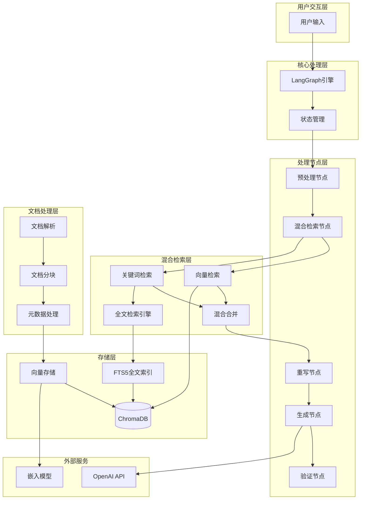
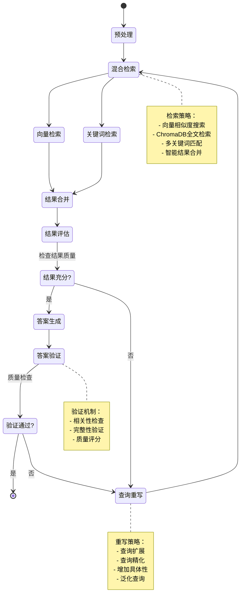

# 智能对话系统

基于 LangGraph 的智能对话系统，集成了文档处理、向量检索、自我纠错等功能，提供高质量的问答体验。

## 系统特性

### 核心功能
- **智能查询处理**: 支持查询预处理和意图检测
- **文档智能检索**: 基于向量相似度的精准检索
- **自我纠错机制**: 自动检测和纠正错误答案
- **文档分块处理**: 支持语义分块和结构化分块
- **元数据管理**: 文档元数据提取和增强
- **查询重写优化**: 动态优化查询以提升检索效果

### 技术亮点
- **LangGraph状态管理**: 可视化的对话流程控制
- **混合检索策略**: 结合语义检索和MMR算法
- **智能分块算法**: 保持语义完整性的文档分割
- **多层相关性评分**: 确保检索结果的高质量
- **ChromaDB向量存储**: 高效的向量数据库支持
- **模块化架构**: 易于维护和扩展的代码结构

## 系统架构

### 整体架构图



### LangGraph状态流转图



## 核心功能实现

### 查询预处理

查询预处理负责清理和标准化用户输入，提取关键信息：

- **查询清理和标准化**：去除无关字符，统一格式
- **关键词提取**：识别查询中的核心关键词
- **意图检测**：分析用户查询的意图类型
- **复杂度评估**：评估查询的复杂程度
- **参数调整**：根据复杂度动态调整处理参数

### 文档检索

基于ChromaDB的混合检索系统，结合向量搜索和全文检索：

- **混合检索策略**：同时执行向量搜索和关键词搜索
- **智能权重分配**：向量搜索权重0.7，关键词搜索权重0.3
- **结果合并去重**：智能合并多种检索结果，去除重复文档
- **综合评分排序**：结合向量相似度和关键词匹配分数
- **质量过滤**：过滤低质量结果，确保检索精度

#### ChromaDB全文检索特性

- **原生全文检索**：ChromaDB内置全文检索引擎，无需外部依赖
- **多关键词匹配**：支持复杂的关键词组合查询
- **智能分词**：自动处理中英文分词和标准化
- **相关性评分**：基于TF-IDF和BM25算法的相关性计算
- **条件查询**：支持内容、标题、摘要等多字段匹配
- **分数融合**：结合向量距离和关键词匹配分数

### 查询重写

当检索结果不充分时，系统会智能重写查询以提高检索效果：

- **缺陷分析**：分析当前检索结果的不足之处
- **策略选择**：根据分析结果选择合适的重写策略
- **具体性增强**：为过于宽泛的查询增加具体性
- **查询泛化**：为过于狭窄的查询进行泛化处理
- **关键词扩展**：补充缺失的相关关键词
- **迭代优化**：记录重写次数和策略，避免无限循环

### 答案生成

基于检索到的文档生成高质量答案：

- **上下文构建**：整合检索到的相关文档内容
- **提示词优化**：构建结构化的提示词模板
- **LLM调用**：使用大语言模型生成答案
- **置信度计算**：评估答案的可信度和质量
- **答案优化**：确保答案的准确性、完整性和实用性

### 答案验证

对生成的答案进行质量检查和验证：

- **相关性检查**：验证答案与用户问题的相关程度
- **完整性检查**：确保答案充分回答了用户的问题
- **准确性检查**：验证答案内容与源文档的一致性
- **综合评分**：结合多个维度计算答案质量分数
- **阈值判断**：基于质量分数决定是否接受答案或重新处理

### 系统输出格式

系统采用结构化的JSON格式输出，包含LLM回答和详细的参考数据块：

**输出结构说明：**
- **answer**：LLM生成的最终答案
- **reference_blocks**：参考文档块列表，包含内容、来源、相关性得分等
- **confidence_score**：答案置信度分数
- **processing_time**：处理耗时
- **metadata**：包含查询信息、检索统计、会话数据等元信息

#### 输出格式说明

**JSON结构包含以下字段：**
- **answer**: 字符串，LLM生成的最终答案
- **reference_chunks**: 数组，包含相关文档块的详细信息
  - chunk_id: 文档块编号
  - content: 文档块内容
  - source: 来源文件名
  - relevance_score: 相关性得分(0-1)
  - is_relevant: 是否相关的布尔值
  - metadata: 包含文件路径、页码、章节等详细元数据
- **confidence_score**: 数值，答案置信度(0-1)
- **processing_time**: 数值，处理耗时(秒)
- **metadata**: 对象，包含查询统计、会话信息等元数据

#### 示例输出

系统会返回包含以下信息的JSON响应：
- 基于检索文档生成的详细答案
- 相关文档块的内容和来源信息
- 每个文档块的相关性评分和推理说明
- 整体的置信度分数和处理时间
- 完整的查询处理元数据和统计信息

## 文档处理

### 语义分块

基于语义相似度的智能文档分块：

- **段落分割**：将文档按段落进行初步分割
- **嵌入计算**：为每个段落计算向量嵌入
- **相似度聚类**：基于语义相似度将段落聚合成块
- **文档转换**：将分块结果转换为标准Document对象
- **元数据保留**：保持原始文档的元数据信息

### 结构化分块

保持文档结构的分块处理：

- **Markdown分块**：基于标题层级进行结构化分块
- **HTML分块**：按HTML标签结构进行分块处理
- **纯文本分块**：基于段落和换行符进行分块
- **格式保留**：维护原始文档的格式和结构信息
- **类型识别**：自动识别文档类型并选择合适的分块策略

### 元数据处理

文档元数据提取和增强：

- **元数据提取**：自动提取文档的基础元数据信息
- **策略调整**：基于元数据动态调整分块策略
- **分块执行**：根据选定策略执行文档分块
- **元数据增强**：为每个分块添加丰富的元数据
- **信息整合**：将原始元数据与增强信息进行整合

## 技术栈

### 核心框架
- **LangGraph**: 状态图管理和工作流编排
- **LangChain**: LLM集成和文档处理
- **ChromaDB**: 向量数据库和全文检索（基于SQLite FTS5）
- **OpenAI**: 大语言模型服务

### 检索技术
- **向量检索**: 基于OpenAI embeddings的语义相似度搜索
- **全文检索**: ChromaDB原生where_document全文搜索
- **混合检索**: 结合向量搜索和关键词匹配的综合检索
- **多关键词匹配**: 要求每个结果至少匹配两个关键词

### 文档处理
- **pdfplumber**: PDF文档解析
- **python-docx**: Word文档处理
- **openpyxl**: Excel文档处理
- **pandas**: 数据处理和分析

### 依赖管理
```bash
# 核心依赖
langchain>=0.1.0
langgraph>=0.1.0
langsmith>=0.1.0
openai>=1.0.0
chromadb>=0.4.0

# 文档处理
pdfplumber>=0.9.0
python-docx>=0.8.11
openpyxl>=3.1.0
pandas>=2.0.0

# 工具库
python-dotenv>=1.0.0
```

## 启动方式

### 环境要求
- **Python**: 3.8+ (推荐 3.10+)
- **内存**: 最少 4GB RAM (推荐 8GB+)
- **存储**: 至少 2GB 可用空间
- **网络**: 需要访问 OpenAI API

### 安装步骤

#### 1. 克隆项目
```bash
git clone <repository-url>
cd agent
```

#### 2. 创建虚拟环境
```bash
# 使用 venv
python -m venv venv

# Windows
venv\Scripts\activate

# Linux/Mac
source venv/bin/activate
```

#### 3. 安装依赖
```bash
pip install -r requirements.txt
```

#### 4. 环境变量配置
创建 `.env` 文件：
```env
# OpenAI配置
OPENAI_API_KEY=your_openai_api_key_here
OPENAI_MODEL=gpt-4

# LangSmith监控（可选）
LANGCHAIN_API_KEY=your_langchain_api_key
LANGCHAIN_TRACING_V2=true
LANGCHAIN_PROJECT=intelligent-conversation-system

# ChromaDB配置
CHROMA_DB_PATH=./chroma_db
CHROMA_COLLECTION_NAME=knowledge_base

# 日志配置
LOG_LEVEL=INFO
LOG_FILE=./logs/system.log
```

### 启动模式

#### 基础启动
```bash
python main.py
```

#### 调试模式启动
```bash
python main.py --debug --log-level DEBUG
```

## 项目结构

```
agent/
├── main.py                     # 主程序入口
├── config.json                # 配置文件
├── requirements.txt           # 依赖列表
├── .env                       # 环境变量
│
├── src/                       # 源代码目录
│   ├── conversation_graph/    # LangGraph对话图
│   │   ├── main_langgraph.py # 主图构建
│   │   ├── self_corrective_rag.py # 自我纠错RAG
│   │   ├── state.py          # 状态定义
│   │   └── nodes/            # 处理节点
│   │       ├── preprocessing.py # 预处理节点
│   │       ├── retrieval.py     # 检索节点
│   │       ├── rewrite.py       # 重写节点
│   │       ├── generation.py    # 生成节点
│   │       └── validation.py    # 验证节点
│   │
│   ├── retrieval/             # 检索系统
│   │   ├── advanced_retrieval_manager.py # 高级检索管理
│   │   └── chroma_hybrid_retriever.py    # ChromaDB混合检索
│   │
│   ├── document_processing/   # 文档处理
│   │   ├── semantic_chunker.py  # 语义分块
│   │   ├── structured_chunker.py # 结构化分块
│   │   └── loaders/          # 文档加载器
│   │
│   ├── metadata/              # 元数据管理
│   │   ├── metadata_extractor.py # 元数据提取
│   │   ├── metadata_enhancer.py  # 元数据增强
│   │   └── metadata_aware_semantic_chunker.py # 元数据感知分块
│   │
│   ├── core/                  # 核心组件
│   │   ├── config_manager.py # 配置管理
│   │   ├── prompt_manager.py # 提示管理
│   │   └── retriever_factory.py # 检索器工厂
│   │
│   └── shared/                # 共享工具
│       ├── utils.py          # 通用工具
│       └── text_utils.py     # 文本处理工具
│
├── documents/                 # 文档存储目录
├── chroma_db/                # ChromaDB数据目录
└── logs/                     # 日志文件目录
```

## 开发指南

### 扩展开发

#### 添加新的处理节点
```python
# 在 conversation_graph/nodes/ 目录下创建新节点
def custom_processing_node(state: ConversationState) -> ConversationState:
    """自定义处理节点"""
    # 实现自定义处理逻辑
    processed_data = custom_process(state.question)
    state.metadata['custom_result'] = processed_data
    return state

# 在 main_langgraph.py 中注册节点
graph.add_node("custom_process", custom_processing_node)
graph.add_edge("preprocess", "custom_process")
graph.add_edge("custom_process", "retrieve")
```

#### 自定义配置参数
```python
# 在 config.json 中添加新配置
{
  "custom_feature": {
    "enabled": true,
    "parameter1": "value1",
    "parameter2": 100
  }
}
```

### 测试和调试

#### 运行测试
```bash
# 运行所有测试
python -m pytest tests/ -v

# 运行特定测试
python -m pytest tests/test_retrieval.py -v
```

#### 性能监控
系统集成了 LangSmith 监控，可以追踪：
- 查询处理时间
- 检索质量指标
- 答案生成效果
- 系统错误和异常

## 许可证

MIT License